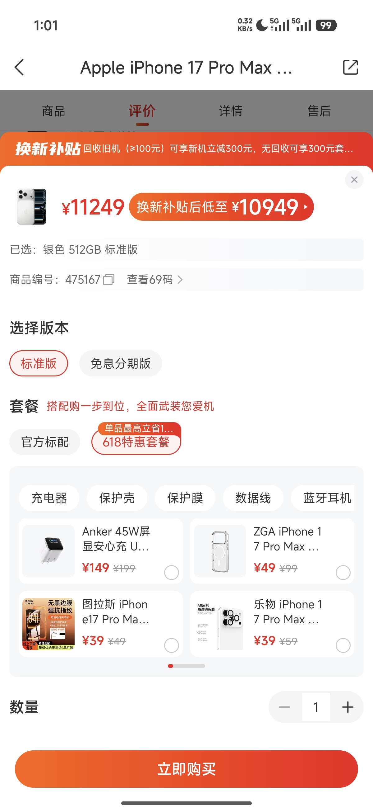
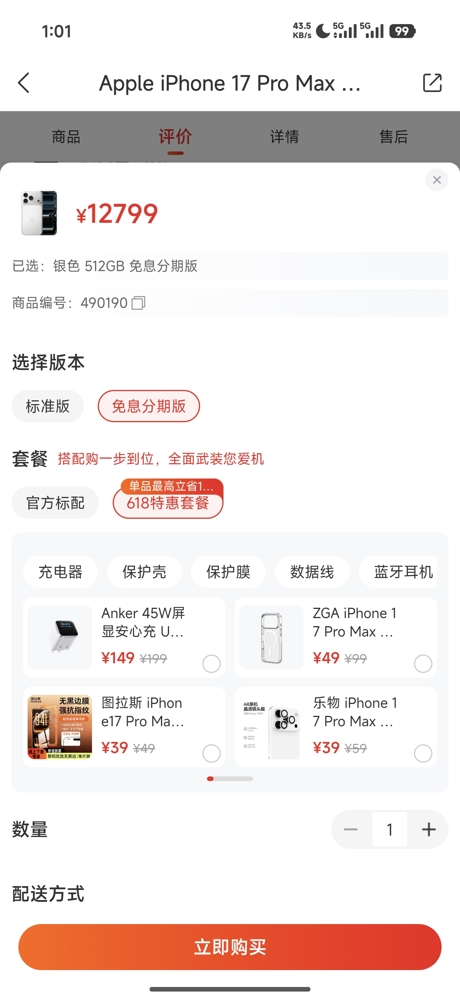
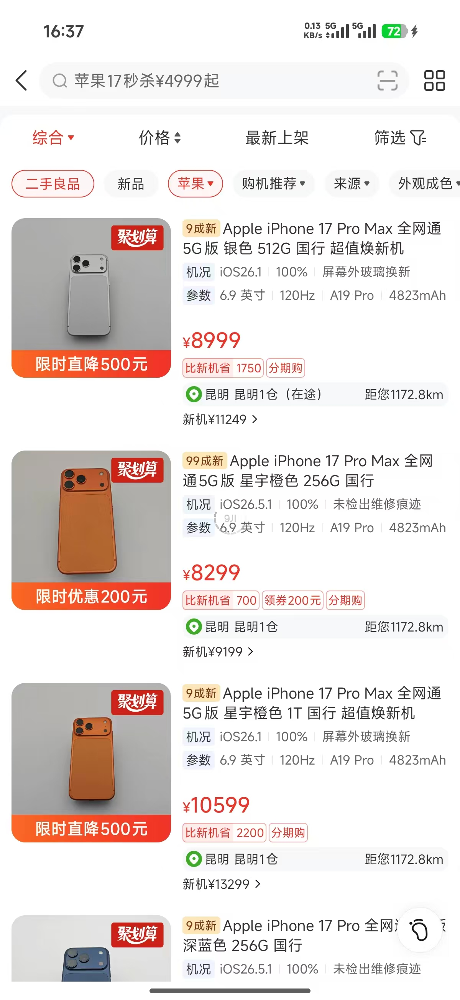
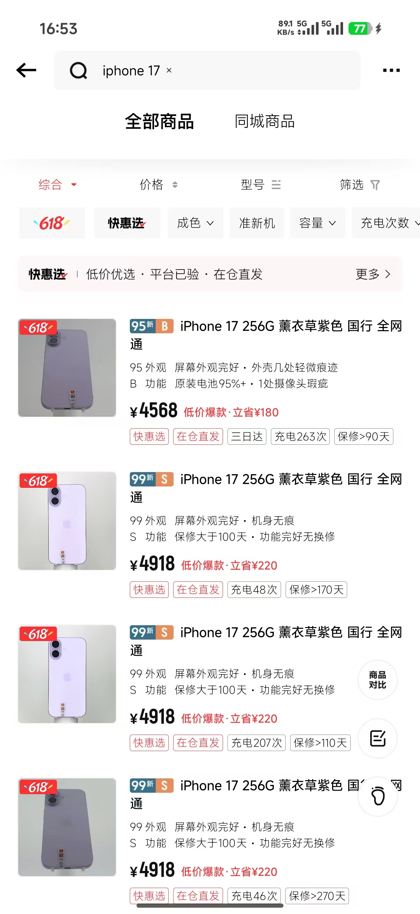

# 九机业务分期复盘&业务经验交流

### 核心判断

- **分期本质是价格转译工具**：九机不是把分期当支付方式，而是把分期做成高客单二手零售的成交基础设施：用月供降低价格压力，用免息提高成交确定性，所以分期 GMV 渗透率能到 29.4%。

- **九机门店服务更有温度**：九机进店先做轻接待，再给用户自由逛店空间，形成更自然的零售场景。转转门店更偏明确需求履约，后续可学习九机在进店引导和现场陪伴上的服务颗粒度。

- **九机在免息商品上更主动**：九机已在分期维度主动尝试“提价做免息”，用分期版价格覆盖手续费，同时保留商家利润空间。相比之下，转转当前更多停留在现有支付能力承接，先发性和商品化表达仍需加强。

## 一、九机业务分期数据一览

### 1.1 核心数据

- **日均销售订单**：131

- **日均销售GMV**：¥32万

- **分期订单渗透率**：19.3%

- **大盘客单价**：¥2,443

- **免息订单占比**：72%

- **分期前动销天数**：18天

- **日均分期订单**：25

- **日均分期GMV**：¥9.4万

- **分期GMV渗透率**：29.4%

- **分期客单价**：¥3,760

- **免息客单价**：¥3,850

- **分期后动销天数**：13天

📅 数据周期：2025年9月 — 2026年3月

📐 指标说明：分期订单渗透率 = 分期订单 ÷ 大盘订单 ｜ 免息订单占比 = 免息订单 ÷ 分期订单

🎯 分期动作：12期免息叠加分期满减

📌 动销天数：分期前取25年10月均值；分期后取25年11月均值

### 1.2 趋势判断

#### 渗透率走势

| 指标 | 现状 | 趋势 |
| --- | --- | --- |
| 订单渗透率 | 起步10%（2025.09）→ 稳定在**20-23%**（2026上半年），近30天均值约**22%** | 从起步期进入稳定期 |
| GMV渗透率 | **九机 29.4%**，转转仅为**15%**— 九机是转转的 2 倍 | 分期主要拉动高客单成交，而不是单纯增加支付方式 |
| 免息驱动模式 | **72%**分期订单为免息；高价格段（¥3,899+）免息占比接近**90%** | 九机分期基本由免息驱动，用户不主动承担手续费 |
| 月度波动 | **2月（春节/年货季）为峰值月**，渗透率冲高至约 25% | 高价换机节点更适合推免息分期 |

### 1.3 价格段分析

💡 价格越高，分期渗透率越高（1.6%→58.8%）。核心价区（¥1,798+），分期商品动销率比非分期高出80%+。分期是库存周转加速器。

| 价格段 | 日均订单 | 日均分期 | 分期渗透率 | 客单价 | 分期动销率 | 非分期动销率 |
| --- | --- | --- | --- | --- | --- | --- |
| 198-398元 | 18 | 0.3 | 1.6% | ¥290 | — | 2.4%/月 |
| 398-798元 | 32 | 2.2 | 6.8% | ¥590 | — | 3.1%/月 |
| 798-1,798元 | 38 | 5.8 | 15.2% | ¥1,280 | 4.2%/月 | 2.8%/月 |
| 1,798-2,798元 | 22 | 5.1 | **23.3%** | ¥2,260 | **5.8%/月** | 3.2%/月 |
| 2,798-3,898元 | 14 | 4.6 | **32.9%** | ¥3,320 | **6.5%/月** | 3.5%/月 |
| 3,898-5,999元 | 5 | 2.2 | **43.8%** | ¥4,850 | **7.2%/月** | 3.8%/月 |
| 5,999元以上 | 2 | 1.2 | **58.8%** | ¥7,200 | **8.0%/月** | 4.0%/月 |

### 1.4 分期潜力测算

💡 同售功能上线后，分期单量预估**3-5倍增长**（20-30单 → 75-140单/天）

| 场景 | 日销 | 分期渗透率 | 日分期单量 | 月分期GMV |
| --- | --- | --- | --- | --- |
| 当前（3,000台上架） | 90-130 | 19-23% | 20-30 | ¥12-24万 |
| **同售上线后**（全量1.5万台） | 300-400 | 25-35% | **75-140** | **¥45-110万** |

### 1.5 九机商户画像

| 企业 | 九机网，云贵区域头部二手手机连锁 |
| --- | --- |
| 门店 | 400-600家 |
| 转转APP目前销量 | 约90-130单/天 |
| 客单价 | 2,000-4,000元 |
| 库存 | 1-2万台（转转仅上架~3,000台，约20%） |

## 第二部分 九机业务经验交流

### 2.1 提价做免息业务分析

同一商品 iPhone 17 Pro Max 1TB：12期免息款价格**¥12,799**vs 全款参考价**¥10,949**，价差**¥1,850**，提价比例**16.90%**

⬅ 标准款（¥10,949）

➡ 提价免息款（¥12,799）

### 2.2 分期利益点表达

🔑**决策前置 vs 决策滞后**：九机在浏览阶段植入分期认知，转转在支付阶段才告知——差了整个决策流程。

建议：转转在商品列表页增加「可分期」「月供¥XXX」轻量级标签。

⬅ 九机商品列表

➡ 转转商品列表

#### 2.3 收银台支付方式对比 + 分期费率

#### 支付方式覆盖

| 类别 | 转转 | 九机 |
| --- | --- | --- |
| 普通支付 | 微信支付、支付宝支付、**京东支付** | 微信支付、支付宝支付、**云闪付** |
| 分期支付 | 信用卡分期、**京东白条**、花呗分期、**分付** | **京东白条分期**、花呗分期、**工行分期** |

#### 分期费率横向对比（商贴费率）

九机的优势来自银行直连渠道，尤其是工行分期在 3/6/12/24 期均为最低费率。转转应优先补工行等低费率银行直连分期，而不是只在现有商贴渠道内做补贴。

- **3期最低**：1.0%（九机 · 工行分期）

- **6期最低**：1.8%（九机 · 工行分期）

- **12期最低**：3.5%（九机 · 工行分期）

- **24期最低**：8.0%（九机 · 工行分期）

| 分期方式 | 3期 | 6期 | 12期 | 24期 | 平台 |
| --- | --- | --- | --- | --- | --- |
| 九机银行直连渠道 |  |  |  |  |  |
| **工行分期** | **1.0%** | **1.8%** | **3.5%** | **8.0%** | 九机 |
| 信用卡分期 | 1.5% | 3.0% | 6.0% | 12.0% | 九机 |
| 花呗分期 | 2.3% | 4.5% | 7.5% | — | 九机 |
| 白条分期 | 2.4% | 4.5% | 7.5% | — | 九机 |
| 转转现有商贴渠道 |  |  |  |  |  |
| 京东白条商贴 | 1.2% | 2.25% | 3.75% | 10.5% | 转转 |
| 花呗商贴 | 1.75% | 4.0% | 6.4% | 12.5% | 转转 |
| 信用卡商贴 | 1.8% | 2.8% | 4.8% | 8.8% | 转转 |
| 京东信用卡商贴 | 1.8% | 3.15% | 5.25% | 9.5% | 转转 |
| 微信分付 | 1.8% | 4.5% | 7.5% | 15.0% | 转转 |

### 2.4 线下门店交易链路

核心不是“服务态度”差异，而是门店心智和交易链路差异：九机更像“逛门店”，进店先给温水、轻引导后让用户自由浏览；转转更像“满足明确需求”，用户来找机、验机、付款。九机把门店结账做成销售节点，转转目前更像自助支付工具。分期、配件、权益都应该在结账前后被主动触发。

#### 1）结账节点：从自助支付变成销售机会

| 维度 | 九机 | 转转 |
| --- | --- | --- |
| 进店引导 | 进店先给一杯温水，简单接待后保持距离，让用户有“逛门店”的空间 | 用户多带着明确目标进店，门店更偏“满足需求”和完成交易 |
| 结账触发 | 用户召唤店员到身边，店员接管成交 | 用户自行扫码，系统完成支付 |
| 店员角色 | **成交推动者**：确认需求、推荐方案、引导支付 | **弱参与**：更多承担看店和答疑 |
| 销售动作 | **配件 + 权益 + 分期**在结账时一起推荐 | 支付动作与销售动作基本割裂 |
| 分期触达 | 店员可在支付前解释免息和月供 | 主要依赖用户自己在小程序里发现 |
| 结果差异 | 结账环节可提升客单价和金融转化 | 结账环节只完成收款，增量空间被浪费 |

**九机流程：**进店轻接待→自由逛店→选机→店员确认需求→推荐配件/权益/分期→Pad收银→完成支付

**转转流程：**带需求进店→选机/验机→扫码→小程序支付→完成交易

#### 2）支付体系：门店需要支持分期成交

| 维度 | 转转门店 | 九机门店 |
| --- | --- | --- |
| 支付工具 | 用户自己手机 | **店员手持Pad** |
| 支付方式 | 仅扫码/APP支付 | **刷卡 + 主动扫码 + 被扫** |
| 分期支持 | ❌**不支持** | ✅**支持分期 + 免息** |
| 收银台 | 二维码即收银台 | **无固定收银台，Pad即收银台** |
| 会员识别 | 无 | 扫会员码 → 识别身份 + 积分 |
| 店员参与 | 不参与 | 全程参与，主动推销 |

核心差距：转转门店现在更像展示场所，支付走线上；九机门店本身就是支付场景。门店不支持分期，等于放弃高客单成交时最强的金融转化点。

建议：优先补门店分期收银能力，让店员能在现场发起分期方案，而不是把用户完全交给线上小程序。

#### 3）品类承接：多品类提高连带销售空间

| 维度 | 九机（综合店） | 转转（单一店） |
| --- | --- | --- |
| 品类线 | **7大品类**（手机/配件/母婴/平板/笔记本/摄影/手表） | 1-2个（二手3C为主） |
| 客单价跨度 | 2元配件到万元旗舰机 | 2,000-4,000元 |
| 单店利用率 | **高**（多品类共享流量） | 低（品类单一、流量浪费） |
| 引流能力 | **强**（配件/母婴低价引流） | 弱 |
| 连带销售 | **强**（配件+手机+权益） | 弱 |

## 三、转转可落地动作

| 优先级 | 动作 | 目的 | 落地口径 | 验证指标 |
| --- | --- | --- | --- | --- |
| P0 | **商品列表增加月供/可分期标签** | 把分期心智前置到浏览阶段 | 列表页露出“可分期”“月供¥XXX”，详情页承接免息说明 | 列表点击率、详情页分期点击率、分期下单率 |
| P0 | **门店支持分期收银** | 抓住高客单成交时点 | 店员可现场发起分期方案，不让用户完全回到线上自助支付 | 门店分期成交占比、分期客单价、现场支付完成率 |
| P1 | **引入工行直连分期** | 降低商贴成本，提升免息空间 | 优先谈低费率银行渠道，形成可对商家开放的免息工具 | 商贴费率、免息商品覆盖率、商家使用率 |
| P1 | **设计提价免息商品形态** | 让商家有利润，也有动力推分期 | 支持标准价与免息价并存，分期版价格覆盖手续费 | 免息成交占比、价差覆盖率、商家毛利变化 |

📊 Ludovicus · 转转集团分期业务 · 2026.06.14
